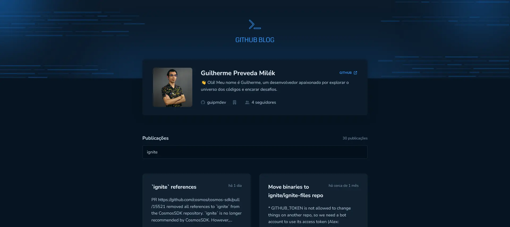
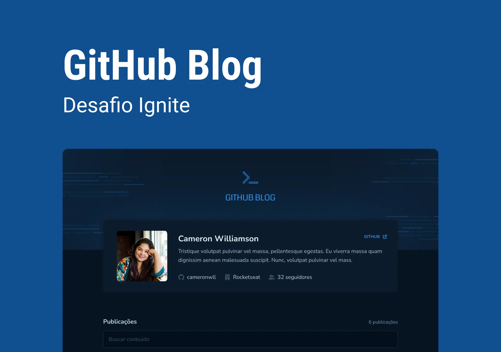

<!-- ===== HEADER ===== -->
<p align="right">
  
  <a href="./README.pt-br.md" title="Ler o README em português brasileiro">
    
  </a>
</p>

<h1 align="center">
  <a
    href="https://guipmdev-github-blog.vercel.app/"
    title="Go to the web application"
  >
    
  </a>
</h1>

<p align="center">
  
  
  
  <a
    href="https://github.com/guipmdev/github-blog/commits/main"
    title="View repository commits"
  >
    
  </a>
  <a href="./LICENSE" title="View project license">
    
  </a>
  <a href="https://www.rocketseat.com.br/" title="Go to the Rocketseat website">
    
  </a>
</p>



<p align="center">
  <a href="https://guipmdev-github-blog.vercel.app/"
    >Go to the web application ↗</a
  >
</p>

<details>
  <summary>
    <h2>📒 Table of Contents</h2>
  </summary>

- [📍 Overview](#-overview)
- [✨ Features](#-features)
- [🤖 Demo](#-demo)
- [🎨 Layout](#-layout)
- [🛠 Technologies](#-technologies)
  - [Website](#website)
  - [Utils](#utils)
- [🚀 Getting Started](#-getting-started)
  - [✔️ Prerequisites](#️-prerequisites)
  - [📦 Installation](#-installation)
  - [⚙️ Usage](#️-usage)
- [📄 License](#-license)
- [👏 Acknowledgments](#-acknowledgments)
</details>

<!-- ===== PROJECT INFOS ===== -->

## 📍 Overview

The project is a _React-based_ web application that provides an interface for reading and searching posts in GitHub repositories. The main functionalities include viewing the basic information of a specific user on the home page, searching for posts using keywords and/or repository filters and reading them in full when accessing them.

The project's purpose is to provide an easy-to-use and visually pleasing application for browsing and exploring blogs, improving the content reading and discovery experience.

## ✨ Features

👤 View the details of **my GitHub user**

🔎 **Search for posts** in all repositories

🏷 Use **filters** to specify in which repo you want to search

📰 **Read amazing posts** directly on the platform, or open them in GH itself

## 🤖 Demo

https://github.com/guipmdev/github-blog/assets/136738335/1d8f30bd-f7ff-4507-84e9-efd0bf121876

## 🎨 Layout

The layout of the application was designed by **Rocketseat** and is available on [Figma](<https://www.figma.com/file/BYpokjkgwb2kamROXb1Z7X/GitHub-Blog-(Community)>).

<p align="center">
  
</p>

## 🛠 Technologies

The following tools were used to build the project:

### Website

<p>
  <a href="https://vitejs.dev/">
    
  </a>
  <a href="https://react.dev/">
    
  </a>
  <a href="https://www.typescriptlang.org/">
    
  </a>
  <a href="https://eslint.org/">
    
  </a>
  <a href="https://github.com/rocketseat/eslint-config-rocketseat">
    
  </a>
</p>

<p>
  <a href="https://reactrouter.com/">
    
  </a>
  <a href="https://axios-http.com/">
    
  </a>
  <a href="https://react-hook-form.com/">
    
  </a>
  <a href="https://github.com/colinhacks/zod">
    
  </a>
  <a href="https://date-fns.org/">
    
  </a>
  <a href="https://react-hot-toast.com/">
    
  </a>
  <a href="https://www.davidhu.io/react-spinners/">
    
  </a>
</p>

<p>
  <a href="https://styled-components.com/">
    
  </a>
  <a href="https://react-icons.github.io/react-icons/">
    
  </a>
  <a href="https://uiwjs.github.io/react-markdown-preview/">
    
  </a>
  <a
    href="https://github.com/remarkjs/remark/blob/HEAD/doc/plugins.md#list-of-plugins"
  >
    
  </a>
</p>

_\* See the [<kbd>package.json</kbd>](./package.json) file_

### Utils

<p>
  <a href="https://git-scm.com/">
    
  </a>
  <a href="https://nodejs.org/">
    
  </a>
  <a href="https://figma.com/">
    
  </a>
  <a href="https://fonts.google.com/">
    
  </a>
  <a href="https://code.visualstudio.com/">
    
  </a>
</p>

## 🚀 Getting Started

### ✔️ Prerequisites

Before you begin, ensure that you have the following tools installed on your machine: [Git](https://git-scm.com/downloads), [Node.js](https://nodejs.org/en/download). It's also good to have an editor to work with the code, such as [VSCode](https://code.visualstudio.com/Download).

### 📦 Installation

1. Clone the repository:

```sh
git clone https://github.com/guipmdev/github-blog/
```

2. Change to the project directory:

```sh
cd github-blog
```

3. Install the dependencies:

```sh
npm install
```

### ⚙️ Usage

1. Start the web application:

```sh
npm run dev
```

2. Access https://localhost:5173/ to view the application

## 📄 License

This project is licensed under the terms of the `MIT` license. See the
[LICENSE](./LICENSE) file for additional info.

## 👏 Acknowledgments

> - Many thanks to [Rocketseat](https://www.rocketseat.com.br/) for the layout and tips when putting this project together

<!-- ===== FOOTER ===== -->

---

<p align="center">
  Made with 💙 by
  <a href="https://www.guipm.dev/"> @guipm.dev </a>
  - Feel free to
  <a href="mailto:guipm.dev@gmail.com">contact me</a>!
</p>

<br />

<p align="center">
  <a href="#top">
    <b>↑&nbsp;&nbsp; Return to the top &nbsp;&nbsp;↑</b>
  </a>
</p>
